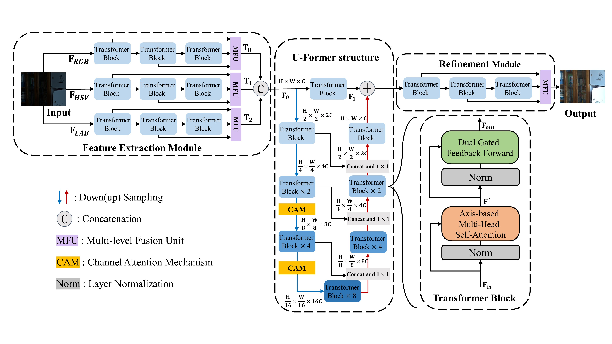

## Low-Light Image Enhancement using Transformer with Color Fusion and Channel Attention  

## [YinBang Sun]((https://github.com/sunyinbang)), Jing Sun, Fuming Sun,  Fasheng Wang, Haojie Li  

This repository contains the dataset, code and pre-trained models for our paper.

## Network Architecture


We propose a new method for Low-Light Image Enhancement. CF-UFormer is an end-to-end deep auto-encoder structure based on Transformer. It consists of Feature Extraction Module (FEM), a U-Former structure and Refinement Module (RM). FEM converts RGB images to the HSV and LAB colour spaces and fusion them with Multi-level Fusion Unit (MFU) to generate more realistic colors. The U-Former structure with a improved Channel Attention Mechanism (CAM) focuses on more important channel dimensions, making up for the shortcomings of the Transformer Block, which only calculates length and width attention scores. RM effectively restores the texture, edge and other image detail information.

## Get Started

### Dependencies and Installation
1. Create Conda Environment 
```
conda create -n CF_UFormer python=3.7
conda activate CF_UFormer
conda install pytorch=1.8 torchvision=0.3 cudatoolkit=10.1 -c pytorch
pip install matplotlib scikit-image opencv-python yacs joblib natsort h5py tqdm
```
2. Clone Repo
```
git clone https://github.com/sunyinbang/CF-UFormer.git
```

3. Install warmup scheduler

```
cd CF_UFormer
cd pytorch-gradual-warmup-lr; python setup.py install; cd ..
```

### Dataset
You can use the following links to download the datasets

1. LOL [[Link](https://daooshee.github.io/BMVC2018website/)]
2. LSRW [[Link](https://github.com/abcdef2000/R2RNet )]

### Pretrained Model
We provide the pre-trained models under different datasets:
- CF-UFormer trained on LOL [[Baidu drive](https://pan.baidu.com/s/1UVwHCj-bpJ1b4mPDJUHAvg?pwd=1234)] with training config file `./configs/LOL/train/training_LOL.yaml`.
- CF-UFormer trained on LSRW [[Baidu drive](https://pan.baidu.com/s/1sYq0hCGPk5hLe5f2qfVmAA?pwd=1234)] with training config file `./configs/LSRW/train/training_LSRW.yaml`.


### Test
You can directly test the pre-trained model as follows

1. Modify the paths to dataset and pre-trained mode. 
```python
# Tesing parameter 
input_dir # the path of data
result_dir # the save path of results 
weights # the weight path of the pre-trained model
```

2. Test the models for LOL and LSRW dataset

You need to specify the data path ```input_dir```, ```result_dir```, and model path ```weight_path```. Then run
```bash
python test.py --input_dir your_data_path --result_dir your_save_path --weights weight_path
```

### Train

1. To download LOL/LSRW training and testing data

3. To train CF-UFormer, run
```bash
python train.py --opt your_config_path
```
```
You need to modify the config for your own training environment.
```
## Citation
```
@article{sun2024low,
  title={Low-light image enhancement using transformer with color fusion and channel attention},
  author={Sun, Yinbang and Sun, Jing and Sun, Fuming and Wang, Fasheng and Li, Haojie},
  journal={The Journal of Supercomputing},
  volume={80},
  number={13},
  pages={18365--18391},
  year={2024},
  publisher={Springer}
}
```

If you have any questions, please contact kevinbang@126.com

---


